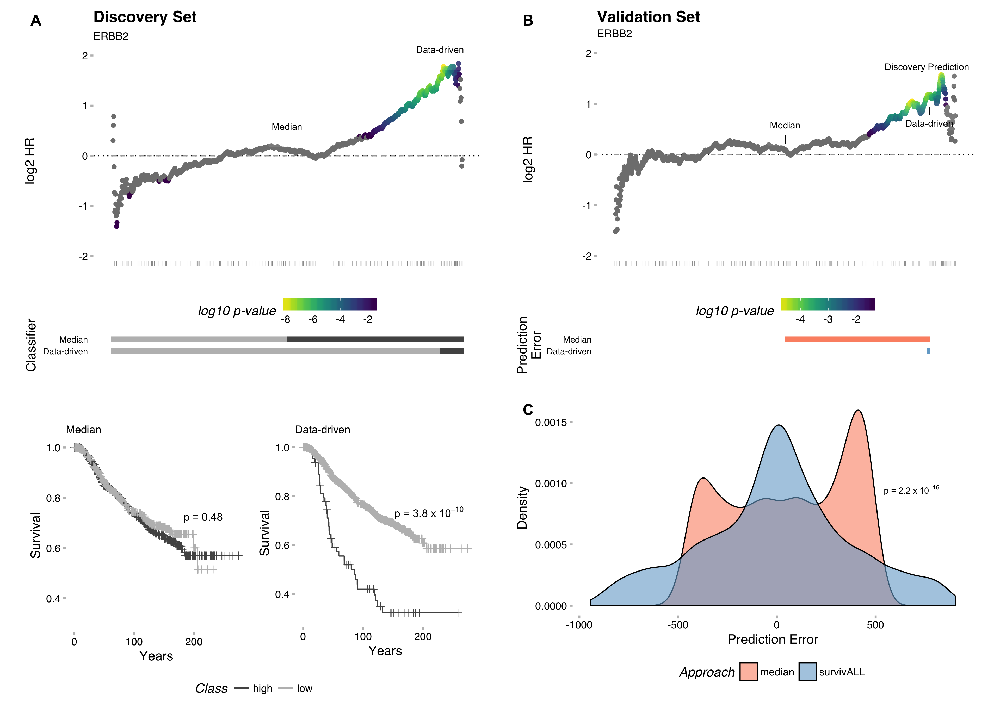
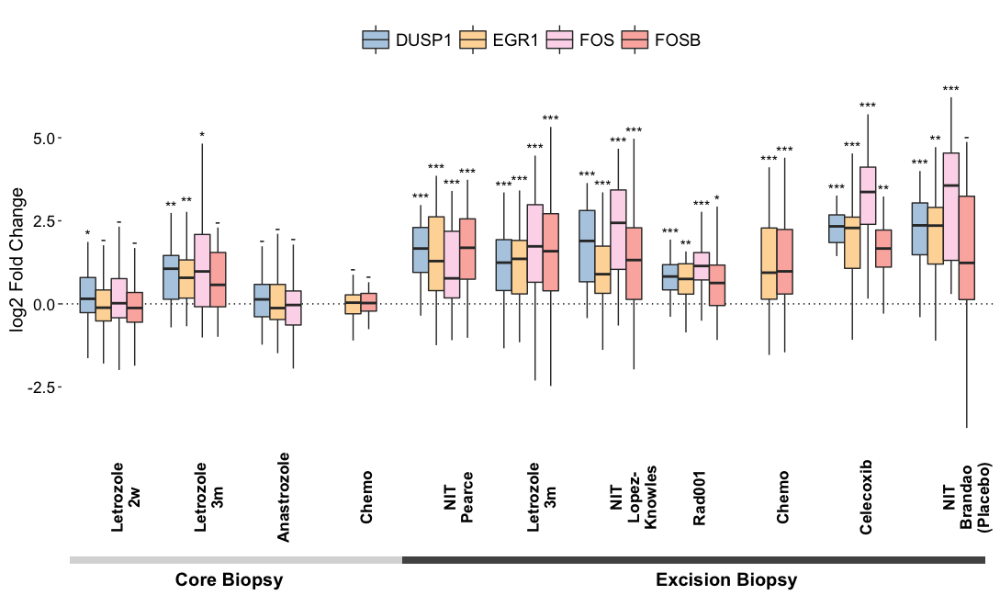

:::{#hero-heading}
Animal welfare research scientist and Registered Veterinary Nurse (RCVS, 2017), combining frontline clinical experience with quantitative research skills. MSc in International Animal Welfare, Ethics and Law and final-year PhD candidate using large real-world datasets to examine how econometric patterns in the online market for dogs reflect consumer psychology, human-animal relationships, purchase behaviour and canine welfare impact, and to translate those patterns into welfare insights and impact metrics, working in R. Driven by a research-to-impact philosophy and a genuine interest and delight in all livings things. 

&nbsp;


:::

&nbsp;

## Overview

I am an early career animal welfare research scientist and Registered Veterinary Nurse (RCVS, 2017) working at the meeting point of clinical practice, data science, and research impact. After close to ten years in veterinary nursing, I moved into research to influence animal welfare beyond the individual patient, completing an MSc in International Animal Welfare, Ethics and Law, and currently, working towards a PhD in Clinical Veterinary Sciences. Now in my final year, I work in R with large real-world datasets, analysing online adverts where I derive insights into the trade's canine welfare impact and consumer psychology/ the human-animal relationship through an econometric lens, and developing my analysis into canine welfare impact metrics with my funders, Dogs Trust. My background in linguistics has also supported my development of language-based programmatic and machine-learning tools that can, for example, extract and normalise breed data from free text. Coming to research from practice, I am fundamentally driven by research-to-impact, an professional interest I've been developing alongside my PhD. I am a subsidised member of the Institute of Directors, and have secured grant funding to develop a research-to-policy network at Easter Bush, as well as lead a research group that is bringing vets, vet nurses and researchers together to build a patient welfare assessment. Alongside this I teach across under- and post-graduate courses at the Royal (Dick) School of Veterinary Studies and Moray House School of Education. I am a member of our Peer-support network and sustainability student champion at Easter Bush Campus. 

Beyond this, I live in Edinburgh with my husband, two children and our foster-failed dogs, with and without home I love to hike, run, read and listen to music. 

## Details

### Education & Scholastic Awards

#### The University of Edinburgh (The Roslin Institute // Royal (Dick) School for Veterinary Studies) 
##### PhD Clinical Veterinary Studies 2023- present
#### The University of Edinburgh (Royal (Dick) School for Veterinary Studies)
##### MSc International Animal Welfare, Ethics and Law (with Distinction) 2016- 2021
#####(Dissertation Awarded ‘Dissertation of the Year 2021’ Award)
#### The College of Animal Welfare
##### Level 3 Diploma in Veterinary Nursing - Registration with the Royal College of Veterinary Surgeons
#### The University of Nottingham
##### BA (Joint Honours) French and Hispanic Studies 

### Publications

#### [Ross, K. E., McMillan, K. M., Bowell, V., Clements, D. N., & Mazeri, S. (2025). The canine welfare, public health and environmental impact of systemic under-regulation within the UK puppy trade: A scoping review. Animal Welfare, 34, 1–16. https://doi.org/10.1017/awf.2025.10046

##### Abstract

....

#### [Ross, K. E., Langford, F., Pearce, D., & McMillan, K. M. (2023). What Patterns in Online Classified Puppy Advertisements Can Tell  Us about the Current UK Puppy Trade. Animals, 13(10), 1–25. https://doi.org/10.3390/ani13101682

##### Abstract

...

#### Conference Abstracts & Presentation

##### Science for Animal Welfare Centenary Conference -  June 2026: "Consumer demand, intervention efficacy and potential canine welfare implications of the puppy trade: Evidence from temporal and linguistic patterns in classified online adverts"
##### Empathy and Compassion in One Health Conference (Sept 2026) : "Development of  Veterinary In-Patient Welfare Assessment Tool"
##### EARL Conf 2026 - "Breed as Brand: Analysing Breed Demand on the Puppy Market with BERT-based NER"

#### Other Achievements
- Co-founder of End of the Line Garden - small-scale rewilding project that supports community groups to apply for outdoor education funding & no-cost site leasing. 
